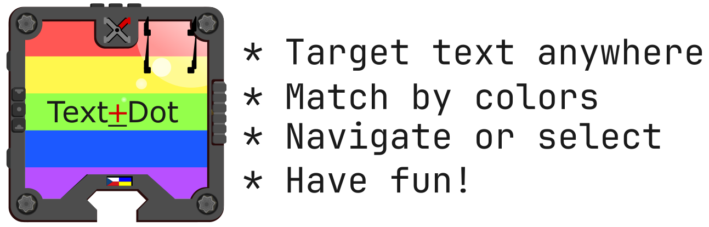
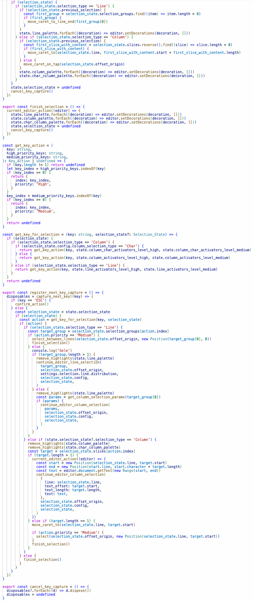
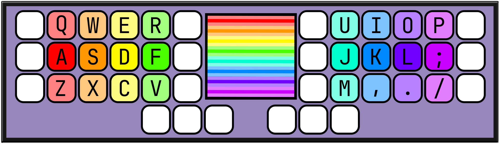
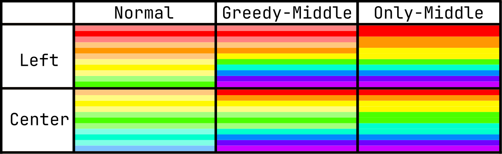
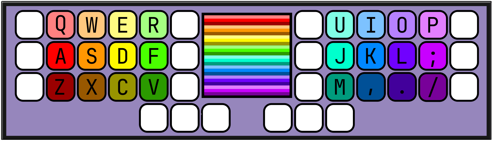
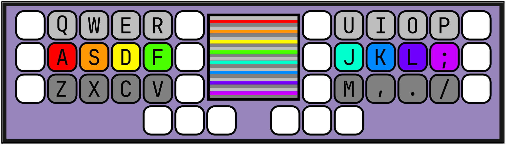
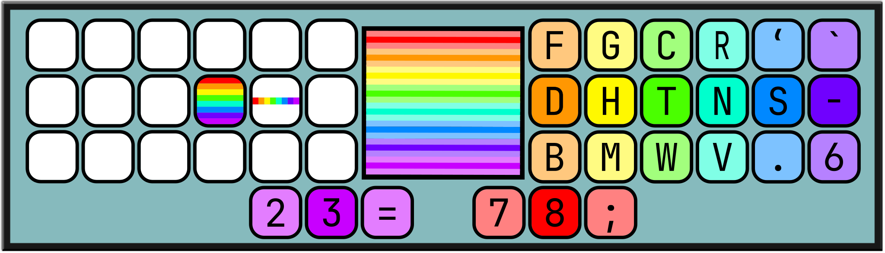

# Text Dot: VS Code Edition

# Quick Start
If you have a standard QUERTY layout you can start experimenting with `Text Dot` right away - press the desired shortcut and match colors containing match with key - refer to first keyboard diagram. At every step of matching there is predetermined position where will the cursor move - you can press `Esc` to confirm `Selection so far`, or match until the very last character.
- `Ctrl + F1` triggers action Text Dot: Line Selection`
- `Ctrl + F2` triggers the action `Text Dot: Column Selection`
	With this you can experiment and understand how `Text Dot` behaves in the default mode, to experiment with not only moving of the cursor but selection of text as well - instead of pressing just the key, use `shift + key`.

To learn more details of `Text Dot` including how it came to be, how it works in all of its states, how it assigns colors to keys and all the configuration options refer to the guide below. This however should be enough to get you started.

  

# The Manual
## Workflow
### Color Matching Keys
You will be matching Colors highlighting text by a set of configurable keys - default config is for QUERTY keyboard with 24 keys assigned. You can make your own config with as many or as few keys as you wish.

#### Key Row
This is a grouping of related keys into three separate rows. Every Color and Key belong to one of three rows.
- Top Row  - auxiliary layer to give more matching options
- Middle Row - this is the most important row, on diagram this is the most saturated row. It is possible to have all matches mapped on this row alone, ignoring other two rows - which may be only set as placeholders
- Bottom Row - auxiliary layer to give more matching options

Default palette is composed of 8 distinct colors of the color spectrum, with their desaturated instances for assignment to Top and Bottom Rows.

#### Action Priority
So far there are two levels of actions - configurable in settings
- High priority action - this performs position selection i.e. moving the cursor, these are generaly lower-case letters, and non-shifted symbols.
- Medium priority action - this performs text range selection - when this happens on Line Selection text between line on which selection started and target line is selected, if this hapens on Column Selection text between cursor origin, and Target location is selected, these are generally upper-case letters and shifted symbols.

On keyboard diagram at the center there is a representation of the screen in full-screen selection mode. When these colors appear you match them according to the configured keymap e.g. for the very top row you use `q`, fo second you use `a`, for the middle green line `f`.

### Basic Actions
You have three fully configurable actions
#### Text Dot: Select Line
Initializes text navigation and selection in whole editor
- it matches lines, and tries to assign them to all the available Colors, if there are more lines of text than colors, multiple lines are assigned to single color, and selecting these will make match of only these lines
- if only one line is target of the match, if High priority `Color Matching Key` was pressed selection switches to Column Matching mode for matched line, Medium priority action performs a selection between the initial line and target line
#### Text Dot: Select Column
Initializes text selection and navigation on the current line.
- if it is immediately confirmed, it jumps to the end of target line
- it first tries to match pairs of symbols (whitespace and symbols) and ids (alphanumeric characters and underscore)
- if match it is not possible to split target match into above, the pair is split into symbols e.g. `: =>`, and subwords like `non Human Readable` or `really _pretty _code`
- in these two situations you usually want to confirm, instead of matching further
- if further matching can't be split into above, selection switches to Character Matching mode
- in this last mode, matching the character puts the caret just before the matched character, if confirmed instead - cursor ends at the very end of all available matches
- text selection in this mode is also done with Medium priority `Color Matching Key`
- default Character Selection mode uses only Colors that are matched by the Middle Row (configurable)
#### Text Dot: Finalize Selection
Confirms current selection, if you are satisfied with match.
- this can be done by `Esc` key as well.
- can be done with pressing `Color Matching Key` that has no match - this will almost always be key `/` on the diagram, except for first phase of Line Selection on full size document

## Origin of Text Dot
I was using Ace Jump plugin for more than 10 years, and got bit bored by matching characters, and that not so visualy pleasing labels spread all over the editor.
I started to develop an IntelliJ plugin, for structural navigation a little inspired by Vim motions, and was pretty happy with the result, it had about 90% of desired functionality, when some light bulb in my head turned on. I still liked the Ace Jump idea quite lot but not the labels, so I started to think colors, and made new prototype in about 2 days. I really liked the result, and this is what I am using in Jetbrains Ides now.
I will be releasing this soon with more features on Jetbrains Ides, but I still use VS Code for some things, and also wanted to explore a bit how VS Code extensions are made, of which result is this plugin, mostly developed in Kotlin in regard to the logic, but adapted to VS Code.
In the future, I will probably expand on this to match all the features that will be available in Jetbrains version, and some

## Matching Rules
Here is reference of how exactly matches are made, and which actions can be taken.
### Line Selection
Initiated via `Text Dot: Line Selection` or `ctrl + F1` by default
#### Initial Line match
Matches all the lines in editor - every line will be assigned one color - multiple lines may be assigned multiple colors
#### Document Slice Line match
There were more colors in document than available Colors to match - at least 1 Color has more lines assigned to it. Matching this group of lines will offer new colors to match for these lines
#### Single Line match
Now that a line which alone is assigned to `Color` is to be matched you have two choices:
- High Priority  action e.g. `a b c` is made and the matching continues in Column Selection mode
- Medium Priority action e.g. `A B C` is made and selection of lines between line that initiated matching and target line is made
### Column Selection
Initiated via `Text Dot: Column Selection` or `ctrl + F2` by default or by matching a single line in Line Selection mode
#### Tap
If you start Column Selection directly and immediately `Esc` or finish in other way without Color matching, for some convenience following behavior is implemented:
- if you are at the end of line, move cursor just before first character on the line
- if cursor is before first character on the line, move cursor to the end of the line
- in all other cases move cursor to the end of line
#### Initial Column match
- Characters on the line are made into pairs of at least one of Tokens part (symbols and spaces) and Id (alphanumeric characters and underscore).
- If there are more pairs than `Matching Colors` as many of central pairs as needed gets merged together.
- This continues until only one pair remains.
#### Pair matched
Singular selected pair is then split into at least one of Symbols and Id parts.
- symbols get split into singular, pair or tripple groups e.g. `++` is considered as single symbol while `([` are two separate symbols.
- id gets split into sub-words if there is word composed of multiple parts like `snake_case` with splits ending at lowercase characters of sub-words. If there are no sub-words it gets split into groups of characters eventually enabling selecting the exact position within word
- finishing match at this point e.g. `Esc` will move caret at the position just after the last character of last available match, same applies for the Initial Column match

#### Logical group of characters matched
With only word/sub-word remaining or multi character symbol - matches happen on character level, when only one character is assigned to 'Matching Color' cursor moves just before the matched character

## Color Distribution

How colors are distributed for matches can be changed in settings. There are 2 properties of distribution in Text Dot:
- Start Position - Left and Center - which tells from which position are colors added e.g. 3 result Left match will select from reds, while 3 result Center match will select from greens
- Middle Row Behavior - in Normal mod all rows are mostly equal, Greedy mode the Top and Bottom layer create match only if all positions of the Middle row already matched, in Only Middle mode only the Middle Row is allowed to match, Top and Bottom rows are ignored

All available distribution modes for default 24 coLor palette:

## Keymaps
There are keymaps for all the modes and key priorities, that is six keymaps - these can be shared for modes, but not for priorities.
- only printable characters are safe to use i.e. those that editor displays
- key on keymap is defined for every Color defined for the mode, so for 24 Colors Palette there must be 24 keys, in same order as Palettes are defined, that is repeating sequence `Top - Middle - Bottom - Top ...`
## Paletes
There are two types of palettes, each is configurable for all Selection modes separately
### Hue based Palette
This is palette based on HSV model, it is simple, quick to set up but not completely customizable
- the list of hue values from 0 to 360 is provided - each entry stands for Top, Middle and Bottom Row Colors
- saturation and value for each Row is separate config - all Hues on a Row share this config
#### Hue based Palette Customization Examples
##### Unique Colors for overy key
Here every key has a different color as saturation value for every row is different.

##### Desaturated Top and Bottom rows
All keys on Top and Bottom row have 0 saturation and different value for color value to have Top matches light-gray and Bottom matches dark-gray

##### Middle Row Only
Top and Bottom Rows are not participating in matching - their data can be just placeholders repeated on every position for these unused Rows

##### Jarek's Custom mode

This is mode I'm using now, I do most of my matches with the right hand, while activating modes by holding the activator keys for the duration of the selection
- When special layer keys are held - they activate Selection Action in given mode (and also special keymap for Text Dot alone), on release they activate Confirm Action
- Palette is default one but the mapping is completely different - mapping Colors to the right side with only the last Color being mappend on the left side
	This means that instead of Q being mapped to Top Red color, and A to Middle Red, keys 7 and 8 are mapped there

### RGB Palette
RGB palette is fully configurable and allows fine-tuning of the palette.
- it is jest list of color hexcode strings
- there is one default test palette generated
- you need to switch to use RGB palettes in setting
- you provide value for every Row, even just placeholder black if you use only Middle Row

### Dark Mode
Basic palete looks trully dreadfull in Dark Mode, you will need to tweak saturation/value in Settings at the very least, but I believe this plugin will always look considerably better in Light Mode, no matter how great color wizzard you are.

## Color Matching
With every keypress you are narowing the search area until there is nothing left and match is made.
Before this happens at any time you can Confirm the match, and action is taken
- if Line Selection phase is active the top most marked line's end position is selected
- if Column Selection phase is active - the last position of the last marked cluster of columns is selected - this is where you want to end most of the time, selecting some identifier
- if you select a character cluster of single character - action is confirmed, and the character before the character is selected - this ensures that every position is reachable within tool

## Tips
### Placeholders for Middle Row Only modes
- you can use placeholders for colors - like black for debugging on RGB Palettes, and some character you don't want to use for matches on every in Top and Botom position like `_a__s__d__...`
### Changing Settings
VS Code has pretty bad Settings UI in my opinion, especially for tool where you want to experiment with Settings a lot. Best way here is just to change settings you want to experiment with - so they get their entry in json settings and continue customizing your settings directly in json file, where you can copy paste values with ease, like this Color Hue palette of 10 as distinct colors as possible:

[
0,
30,
60,
70,
100,
165,
190,
244,
284,
315
]

[
0,
30,
50,
97,
151,
205,
244,
284
]

## Known Issues
- The way `Text Dot` captures user input by registering `type` action means no other plugin can use this action - e.g. Vim plugins, Screencast Mode etc.

## Future Development
Currently, I'll be finishing version for Jetbrains IDEs, after that I will update this version as my time will permit me to do so, feedback is very welcome, custom Keymaps for other layouts and Color Paletes as well (especially Dark Mode paletes, and optimizations for Hue based Rainbow Paletes). 